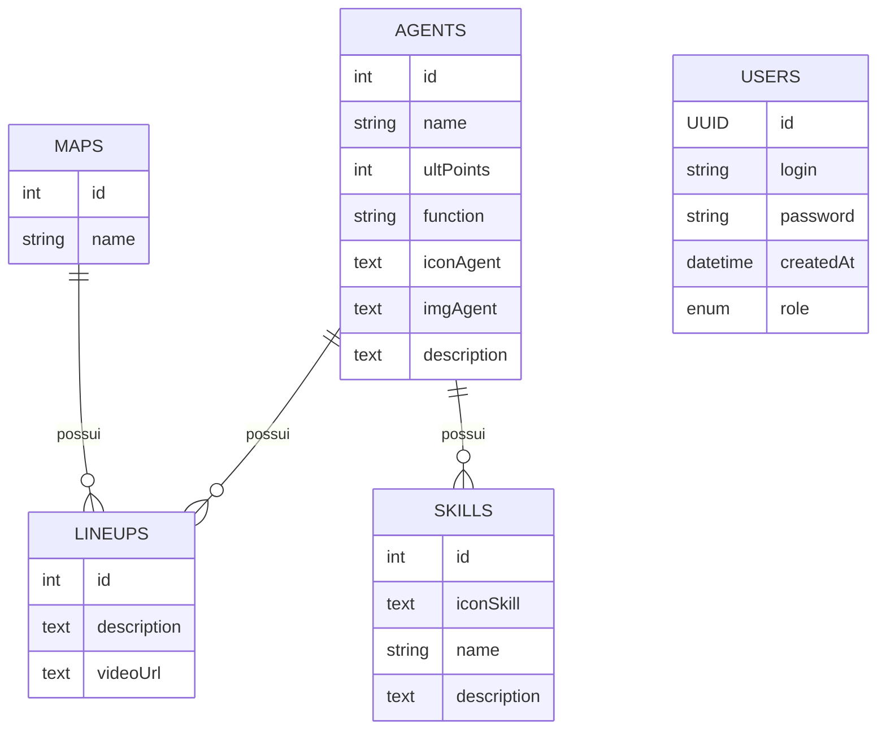
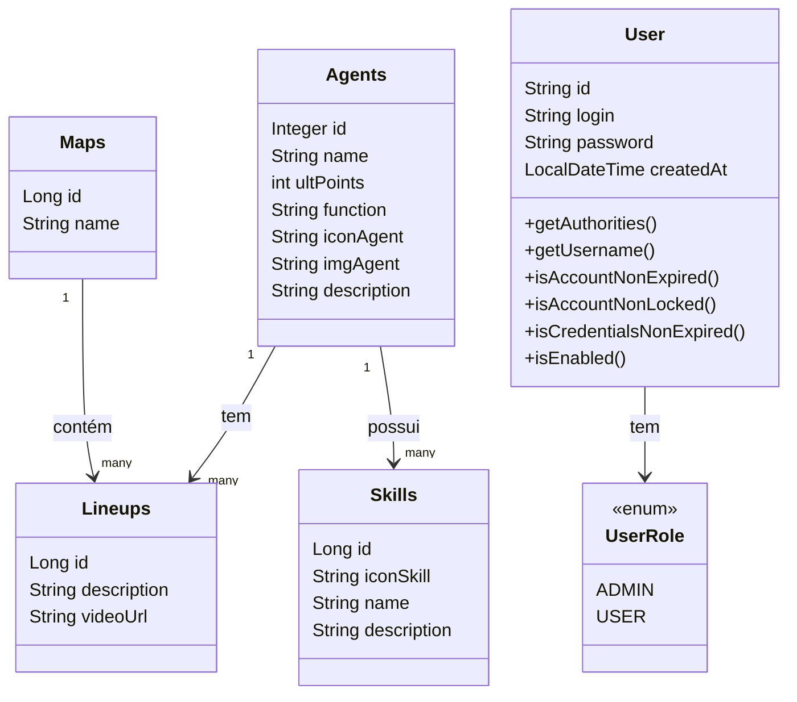

# 🚀 Spring Boot API (Branch: Homologation)

## 📌 Descrição
Este projeto é uma API de **autenticação** desenvolvida com **Spring Boot** e **Spring Security**. Na branch de **homologação (HOM)**, a API utiliza **PostgreSQL** como banco de dados, em vez do H2 usado em desenvolvimento. A API fornece funcionalidades de **registro** e **login** de usuários e será consumida por um frontend desenvolvido em outro framework.

**📌 Esta documentação refere-se à branch `homolog` do projeto.**

## 🛠️ Tecnologias Utilizadas
- ☕ **Java 17**
- 🌱 **Spring Boot 3**
- 🔐 **Spring Security**
- 🗄️ **Spring Data JPA**
- 🛢️ **PostgreSQL**
- 🔑 **JWT (JSON Web Token)**
- 🏗️ **Maven**

## 📋 Requisitos
Antes de rodar o projeto, certifique-se de ter instalado:
- ✅ **Java 17** ou superior
- ✅ **Maven** configurado
- ✅ **PostgreSQL** em execução

## 🛢️ Configuração do Banco de Dados no Ambiente de Homologação (HOM)
No ambiente de homologação, utilizamos o banco de dados **PostgreSQL**. O `application.properties` está configurado da seguinte forma:

```properties
# Configuração do banco de dados PostgreSQL para HOM
spring.datasource.url=jdbc:postgresql://localhost:5432/seu_banco
spring.datasource.username=seu_usuario
spring.datasource.password=sua_senha
spring.datasource.driver-class-name=org.postgresql.Driver

# Configuração do Hibernate (JPA)
spring.jpa.database-platform=org.hibernate.dialect.PostgreSQLDialect
spring.jpa.hibernate.ddl-auto=update
spring.jpa.show-sql=true
```

### ℹ️ Explicação do `application.properties`
- 🔗 `spring.datasource.url`: URL de conexão com o banco PostgreSQL.
- 🔐 `spring.datasource.username` e `spring.datasource.password`: Credenciais para acesso ao banco.
- 🧩 `spring.datasource.driver-class-name`: Driver JDBC do PostgreSQL.
- 🔄 `spring.jpa.hibernate.ddl-auto=update`: Permite que o Hibernate atualize automaticamente o esquema do banco de dados.
- 📊 `spring.jpa.show-sql=true`: Exibe no console as consultas SQL executadas.

## 🔐 Credenciais **Spring Security**(Temporário)
   - 👤 **Usuário**: `admin`
   - 🔑 **Senha**: `123`

## ▶️ Como Rodar o Projeto
1. 📥 Clone o repositório:
   ```sh
   git clone https://github.com/VavaHelper/Vava-API.git
   ```
2. 📂 Acesse o diretório do projeto:
   ```sh
   cd Vava-API
   ```
3. 🔀 Troque para a branch HOM:
   ```sh
   git checkout hom
   ```
4. 🏗️ Compile e execute o projeto:
   ```sh
   mvn spring-boot:run
   ```

## 📡 Endpoints Disponíveis
A API oferece os seguintes endpoints:

### 📝 Registro de Usuário
- **POST** `/auth/register`
- **Request Body:**
  ```json
  {
    "login": "exemplo@email.com",
    "password": "senha123"
  }
  ```

### 🔑 Login de Usuário
- **POST** `/auth/login`
- **Request Body:**
  ```json
  {
    "email": "exemplo@email.com",
    "password": "senha123"
  }
  ```
- **Resposta (sucesso):**
  ```json
  {
    "token": "jwt_token_aqui"
  }
  ```


Sim! Dá pra adicionar **diagramas Mermaid** no seu projeto tranquilamente, especialmente se você estiver usando um visualizador Markdown compatível (como o do GitHub ou extensões no VS Code). Com base nos seus modelos, aqui vai um exemplo de **diagrama ER (Entidade-Relacionamento)** usando Mermaid:

## 📊 Diagrama de Entidades (Mermaid)

<details>
<summary>📌 Clique para visualizar o Diagrama Entidade-Relacionamento (ER)</summary>



</details>

<details>
<summary>📌 Clique para visualizar o Diagrama de Classes UML</summary>



</details>

## 🧩 Como funciona

- **Agentes** se relacionam com **Lineups** e **Skills** (um agente pode ter várias lineups e várias skills).
- **Maps** também têm várias lineups.
- **Users** são separados, com roles definidas no enum `UserRole`.

## 🔮 Futuras Implementações
- 🔄 Recuperação de senha
- 🔗 Integração com OAuth2
- 🎧 Atendimento/Suporte ao Usuário Cliente

## 📜 Licença
Este projeto está sob a licença MIT. Sinta-se à vontade para utilizá-lo e modificá-lo.
