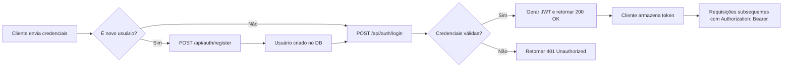

<main align="center">
   <h1 align="center"> Spring Boot API </h1>
</main>

[](#table-of-contents)

## 📑 Índice
1. [Descrição](#descrição)  
2. [Tecnologias](#tecnologias)  
3. [Requisitos](#requisitos)  
4. [Configuração do Banco de Dados](#configuração-do-banco-de-dados)  
5. [Como Rodar](#como-rodar)  
   - [Ambiente Padrão](#ambiente-padrão)  
   - [Branch de Desenvolvimento](#branch-de-desenvolvimento)  
6. [Endpoints](#endpoints)  
7. [Fluxo de Autenticação](#fluxo-de-autenticação)  
8. [Futuras Implementações](#futuras-implementações)  
9. [Documentação Útil](#documentação-útil)  
10. [Licença](#licença)  

---

## 📋 Descrição
Esta API de **autenticação** foi desenvolvida com **Spring Boot** e **Spring Security**, utilizando **PostgreSQL** como banco de dados.  
Ela oferece endpoints para **registro** e **login** de usuários, retornando um JWT (JSON Web Token) para acesso seguro, consumível por um frontend separado.

---

## 🛠 Tecnologias

| Camada          | Tecnologias                                 |
|-----------------|---------------------------------------------|
| Linguagem       | Java 17                                     |
| Framework       | Spring Boot 3, Spring Security, JPA         |
| Banco de Dados  | PostgreSQL                                  |
| Autenticação    | JWT (JSON Web Token)                        |
| Build & Dep.    | Maven                                       |

---

## ✅ Requisitos
- **Java 17** ou superior  
- **PostgreSQL** instalado e em execução  
- **Maven** (3.6+)  

---

## 🗄️ Configuração do Banco de Dados
1. Crie um banco no PostgreSQL:
   ```sql
   CREATE DATABASE vava_api;
   ```

2. Atualize `src/main/resources/application.properties`:

   ```properties
   spring.datasource.url=jdbc:postgresql://localhost:5432/vava_api
   spring.datasource.username=seu_usuario
   spring.datasource.password=sua_senha

   spring.jpa.hibernate.ddl-auto=update
   spring.jpa.show-sql=true
   spring.jpa.properties.hibernate.dialect=org.hibernate.dialect.PostgreSQLDialect
   ```

---

## ▶️ Como Rodar

### Ambiente Padrão (main)

```bash
git clone https://github.com/VavaHelper/Vava-API.git
cd Vava-API
mvn clean install
mvn spring-boot:run
```

### Branch de Desenvolvimento (DSV)

```bash
git clone https://github.com/VavaHelper/Vava-API.git
cd Vava-API
git checkout development
mvn clean install
mvn spring-boot:run
```

---

## 🛣️ Endpoints Disponíveis

| Método | Rota                 | Descrição                      |
| -----: | -------------------- | ------------------------------ |
|   POST | `/api/auth/register` | Registrar novo usuário         |
|   POST | `/api/auth/login`    | Autenticar usuário e gerar JWT |

<details>
<summary>▶️ Exemplo de Payload de Registro</summary>

```json
{
  "username": "exemplo",
  "email": "exemplo@email.com",
  "password": "senha123"
}
```

</details>

<details>
<summary>▶️ Exemplo de Payload de Login</summary>

```json
{
  "email": "exemplo@email.com",
  "password": "senha123"
}
```

**Resposta (sucesso):**

```json
{
  "token": "eyJhbGciOiJIUzI1NiIsInR5..."
}
```

</details>

---

## 🔄 Fluxo de Autenticação



---

## 🚀 Futuras Implementações

* 🔄 Recuperação de senha
* 👥 Perfis de usuário (Admin, Comum)
* 🔐 OAuth2 (Google, Facebook)
* 💬 Sistema de suporte ao cliente

---

## 📚 Documentação Útil

| Tópico                  | Link                                                                                                                                       |
| ----------------------- | ------------------------------------------------------------------------------------------------------------------------------------------ |
| Conventional Commits    | [https://www.conventionalcommits.org/pt-br/v1.0.0/](https://www.conventionalcommits.org/pt-br/v1.0.0/)                                     |
| Spring Boot             | [https://spring.io/projects/spring-boot](https://spring.io/projects/spring-boot)                                                           |
| Spring Security         | [https://spring.io/projects/spring-security](https://spring.io/projects/spring-security)                                                   |
| Hibernate & JPA         | [https://docs.spring.io/spring-data/jpa/docs/current/reference/html/](https://docs.spring.io/spring-data/jpa/docs/current/reference/html/) |
| Design Patterns em Java | [https://refactoring.guru/design-patterns/java](https://refactoring.guru/design-patterns/java)                                             |

---

## 📝 Licença

Este projeto está licenciado sob a **MIT License**. Veja o arquivo [LICENSE](LICENSE) para mais detalhes.
